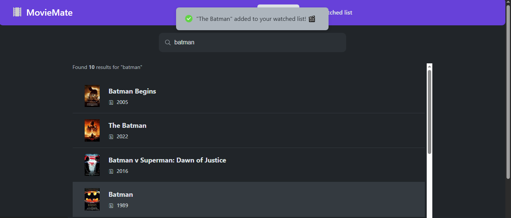

# 🍿 MovieMate

Your personal movie companion! A modern, responsive movie search and tracking application built with React. Navigate through dedicated pages, search for movies, view detailed information, rate them, and keep track of your watched movies list with seamless routing and advanced state management.

## Live Demo

go to:[https://movie-mate-brown.vercel.app/]

## 🚀 Screenshots

**Homepage with Hero Section**


**Search Page with Results**


**Watched Page**


## 📝 Update Log

### Version 5.0.0 (Latest - Context API & Advanced State Management)

- ✅ **Context API Implementation**: Professional state management with MoviesContext for cross-component data sharing
- ✅ **Fully Functional WatchedPage**: Complete watched movies list with modern card-based design
- ✅ **Advanced State Management**: Centralized watched movies state accessible across all components
- ✅ **Improved Component Architecture**: Clean separation between smart and dumb components
- ✅ **Enhanced Styling System**: Dedicated CSS modules for each component with modern design patterns
- ✅ **Responsive Card Design**: Beautiful movie cards with hover effects and professional layout
- ✅ **Persistent Data**: Seamless localStorage integration through Context API
- ✅ **Reusable Button Component**: Consistent button styling across the application

### Version 4.0.0 (Previous - Complete Router Implementation)

- ✅ **Multi-Page Architecture**: Fully implemented React Router with clean URL structure
- ✅ **Dedicated Pages**: Separate routes for Home (`/`), Search (`/search`), Movie Details (`/movie/:id`), and Watched List (`/watched`)
- ✅ **Navigation System**: Sticky navbar with active link highlighting and responsive design
- ✅ **Movie Details Route**: Dynamic routing with URL parameters for movie IDs
- ✅ **Enhanced UX**: Back navigation, breadcrumb-style routing, and intuitive page flow
- ✅ **Layout Components**: Structured layout system with AppLayout, NavBar, and Footer
- ✅ **URL State Management**: Movie details accessible via direct URLs for sharing

## ✨ Features

### 🏠 **Homepage Experience**

- Modern hero section with cinematic background imagery
- Smooth fade-in animations with staggered timing
- Clear call-to-action guiding users to start exploring
- Responsive design with clamp-based typography

### 🔍 **Advanced Search Experience**

- **Full-Page Search**: Dedicated `/search` route for focused movie discovery
- **Debounced Search**: Real-time results with 500ms delay optimization
- **Smart State Management**: Loading, error, welcome, and results states with proper feedback
- **Responsive Results**: Adaptive movie grid with hover effects and smooth transitions

### 📽️ **Comprehensive Movie Details System**

- **Dynamic Routing**: `/movie/:id` URLs for shareable movie pages
- **Rich Information Display**: Plot, cast, crew, ratings, awards, and box office data
- **Interactive Star Rating**: 10-star rating system with hover effects and visual feedback
- **Smart Watched Detection**: Automatic detection of already-rated movies
- **Responsive Layout**: Mobile-optimized design with centered elements
- **Professional Navigation**: Smooth back navigation with breadcrumb-style UX

### 📚 **Advanced Personal Collection**

- **Dedicated Watched Page**: Complete `/watched` route with professional card-based design
- **Context-Powered State**: Advanced state management with React Context API
- **Beautiful Movie Cards**: Modern card design with hover effects and smooth animations
- **Comprehensive Statistics**: Average ratings, runtime, and collection insights with WatchedSummary
- **Quick Actions**: One-click removal of movies from watched list
- **Empty State Handling**: Elegant empty state with call-to-action for new users
- **Responsive Design**: Mobile-optimized layout with proper touch targets

### 🧭 **Professional Navigation & Routing**

- **Clean URLs**: RESTful routing structure for all pages
- **Smart Active States**: Context-aware navigation highlighting (search active on movie details)
- **Responsive Navbar**: Mobile-friendly navigation with proper breakpoints
- **Consistent Layout**: Professional layout system with sticky navbar and footer

### 📱 **Technical Excellence**

- **React Context API**: Professional state management for cross-component data sharing
- **React Router v6**: Modern routing with nested layouts and URL parameters
- **CSS Modules**: Scoped styling preventing conflicts with component-specific styles
- **Custom Hooks**: Reusable logic for movies, localStorage, and keyboard events
- **localStorage Integration**: Persistent data across browser sessions via Context
- **Mobile-First Design**: Responsive breakpoints with modern CSS techniques

## 🛠️ Technologies Used

- **React 18** - Frontend framework with modern hooks and Context API
- **React Router v6** - Client-side routing and navigation
- **React Context API** - Advanced state management for cross-component data sharing
- **CSS Modules** - Scoped styling with component-specific design systems
- **Custom Hooks** - Reusable state management and side effects
- **OMDB API** - Comprehensive movie database and information source
- **Local Storage API** - Persistent data storage integrated with Context
- **Vite** - Modern build tool and development server

## 📦 Installation

1. **Clone the repository**

   ```bash
   git clone https://github.com/amirtavass/MovieMate.git
   cd MovieMate
   ```

2. **Install dependencies**

   ```bash
   npm install
   ```

3. **Set up environment variables**

   Create a `.env` file in the root directory and add your OMDB API key:

   ```env
   VITE_OMDB_API_KEY=your_api_key_here
   ```

   Get your free API key from [OMDB API](http://www.omdbapi.com/apikey.aspx)

4. **Start the development server**

   ```bash
   npm run dev
   ```

5. **Open your browser**

   Navigate to `http://localhost:5173` to see the app in action!

## 🎯 How to Use

### Navigation Flow

1. **Homepage** (`/`) - Start your movie journey with the hero section
2. **Search Movies** (`/search`) - Use the dedicated search page to find movies
3. **Movie Details** (`/movie/:id`) - Click any movie to view comprehensive details
4. **Watched List** (`/watched`) - Manage your personal movie collection

### Key Actions

- **Search**: Type in the search bar (minimum 3 characters) for real-time results
- **View Details**: Click any movie card to navigate to its dedicated details page
- **Rate Movies**: Use the 1-10 star rating system on movie detail pages
- **Add to Collection**: Rate a movie to automatically add it to your watched list
- **Manage Collection**: Navigate to `/watched` to view statistics and remove movies
- **Share Movies**: Copy movie detail URLs to share specific movies

### Keyboard Shortcuts

- **Enter**: Focus the search bar from anywhere
- **Escape**: Navigate back from movie details
- **Browser Back/Forward**: Full browser navigation support

## 📁 Project Structure

```
moviemate/
├── src/
│   ├── components/
│   │   ├── movie/
│   │   │   ├── Movie.jsx
│   │   │   ├── MovieDetails.jsx
│   │   │   ├── MovieDetails.module.css
│   │   │   ├── MovieList.jsx
│   │   │   └── MovieList.module.css
│   │   ├── watched/
│   │   │   ├── WatchedMovie.jsx
│   │   │   ├── WatchedMoviesList.jsx
│   │   │   ├── WatchedMoviesList.module.css
│   │   │   ├── WatchedSummary.jsx
│   │   │   └── WatchedSummary.module.css
│   │   └── ui/
│   │       ├── Box.jsx
│   │       ├── Button.jsx
│   │       ├── Button.module.css
│   │       ├── ErrorMessage.jsx
│   │       ├── Loader.jsx
│   │       ├── Logo.jsx
│   │       └── StarRating.jsx
│   ├── contexts/
│   │   └── MoviesContext.jsx
│   ├── Layout/
│   │   ├── AppLayout.jsx
│   │   ├── AppLayout.module.css
│   │   ├── NavBar.jsx
│   │   ├── NavBar.module.css
│   │   ├── Footer.jsx
│   │   └── Footer.module.css
│   ├── pages/
│   │   ├── HomePage.jsx
│   │   ├── HomePage.module.css
│   │   ├── SearchPage.jsx
│   │   ├── SearchPage.module.css
│   │   ├── MovieDetailsPage.jsx
│   │   ├── MovieDetailsPage.module.css
│   │   ├── WatchedPage.jsx
│   │   └── WatchedPage.module.css
│   ├── hooks/
│   │   ├── useKey.jsx
│   │   ├── useLocalStorageState.jsx
│   │   └── useMovies.jsx
│   ├── App.jsx
│   ├── App.module.css
│   └── index.css
├── public/
│   └── images/
├── .env
├── package.json
└── README.md
```

## 🔧 Available Scripts

- `npm run dev` - Start development server with hot reload
- `npm run build` - Build optimized production bundle
- `npm run preview` - Preview production build locally
- `npm run lint` - Run ESLint for code quality

## 🌟 Key Features & Improvements

### 🎨 **Advanced Architecture**

- **Context API Integration**: Professional state management pattern for cross-component data sharing
- **Component Composition**: Clean separation between container and presentational components
- **Custom Hook Patterns**: Reusable logic abstracted into custom hooks
- **CSS Modules**: Component-scoped styling preventing style conflicts

### 🔍 **Enhanced Search Experience**

- **Dedicated Search Page**: Full-page focus on movie discovery with professional layout
- **Debounced Input**: 500ms delay reduces API calls and improves performance
- **Advanced State Management**: Proper loading, error, and empty states with Context integration
- **Responsive Results**: Adaptive movie grid with smooth hover effects

### 📱 **Mobile-First Responsive Design**

- **Adaptive Navigation**: Touch-friendly navigation with proper active states
- **Flexible Card Layouts**: Modern card design that adapts to all screen sizes
- **Optimized Touch Targets**: Properly sized buttons and interactive elements for mobile
- **Smart Typography**: Responsive font sizing with clamp() for optimal readability

### 🎯 **Advanced Components**

- **Custom Hooks**:
  - `useWatchedMovies` - Context hook for watched movies state
  - `useMovies` - API calls with abort controllers and error handling
  - `useLocalStorageState` - Synchronized localStorage with React state
  - `useKey` - Keyboard event listeners with automatic cleanup
- **StarRating**: Responsive rating component with hover effects and accessibility
- **Button Component**: Reusable button with consistent styling and responsive behavior

## 📱 Responsive Breakpoints

- **Mobile**: `< 640px` - Stacked navigation, card-based layout
- **Tablet**: `640px - 768px` - Intermediate sizing with touch optimization
- **Desktop**: `768px - 1024px` - Enhanced layout with grid systems
- **Large Desktop**: `> 1024px` - Full-width layout with optimal spacing

## 🚀 Deployment

The app is deployment-ready for modern platforms:

**Vercel** (Recommended)

```bash
npm run build
# Deploy the dist folder to Vercel
```

**Netlify**

```bash
# Connect GitHub repo for automatic deployments
# Build command: npm run build
# Publish directory: dist
```

**GitHub Pages**

```bash
# Use GitHub Actions for automated deployment
```

## 🔮 Future Enhancements

### 🎯 Version 6.0.0 (Next Major Release - Advanced Features)

- [ ] **useReducer Integration**: Complex state management for advanced user interactions
- [ ] **Advanced Search Filters**: Filter by genre, year, rating, language, and director
- [ ] **Sorting & Pagination**: Sort results by relevance, year, rating with infinite scroll
- [ ] **Favorites System**: Separate favorites list from watched movies with heart icons
- [ ] **Movie Recommendations**: AI-powered suggestions based on viewing history
- [ ] **Export Features**: Export watched list as PDF, CSV, or JSON
- [ ] **Social Features**: Share movie lists and ratings with friends

### 🚀 Version 7.0.0 (Future Vision - Premium Features)

- [ ] **User Authentication**: Personal accounts with cloud sync and user profiles
- [ ] **Advanced Analytics**: Detailed viewing statistics, trends, and insights dashboard
- [ ] **Watchlist Planning**: Plan future movie viewing with calendar integration
- [ ] **Movie Reviews**: Write and share detailed movie reviews and ratings
- [ ] **Multi-language Support**: Internationalization for global users
- [ ] **Offline Mode**: PWA features for offline movie browsing and management
- [ ] **Custom Themes**: Dark/light themes with user customization options

### 🎨 Technical Improvements

- [ ] **Performance**: Code splitting and lazy loading for faster load times
- [ ] **Accessibility**: Enhanced ARIA labels, keyboard navigation, and screen reader support
- [ ] **SEO**: Meta tags and structured data for better search visibility
- [ ] **Testing**: Comprehensive unit and integration test coverage with Jest and RTL

---

## 🤝 Contributing

Contributions are welcome! Please feel free to submit a Pull Request.

1. Fork the project
2. Create your feature branch (`git checkout -b feature/AmazingFeature`)
3. Commit your changes (`git commit -m 'Add some AmazingFeature'`)
4. Push to the branch (`git push origin feature/AmazingFeature`)
5. Open a Pull Request

## 📄 License

This project is licensed under the MIT License - see the [LICENSE](LICENSE) file for details.

## 🙏 Acknowledgments

- [OMDB API](http://www.omdbapi.com/) for providing comprehensive movie data
- React team for the incredible framework and Context API
- React Router team for powerful routing capabilities
- All the open-source contributors who make projects like this possible

---

**Made with ❤️ by [Amirtavass](https://github.com/amirtavass)**

_MovieMate - Your personal movie companion with professional state management and modern design!_
